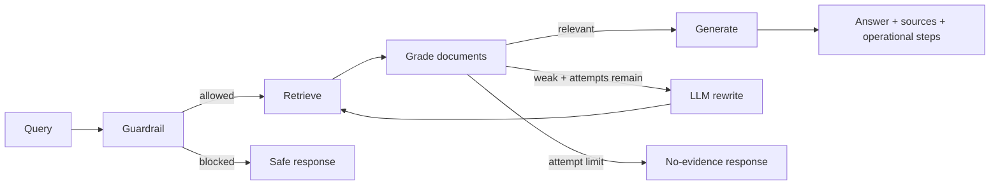

# Production Agentic RAG Platform

Production-oriented Agentic RAG reference implementation using FastAPI, a compiled LangGraph workflow, OpenSearch BM25/hybrid retrieval, Ollama-compatible generation, explicit source lineage, bounded corrective retrieval, evaluation hooks and security guardrails.

## Runtime flow



The graph is compiled with LangGraph and executed asynchronously. Request-scoped `top_k`, search mode, model and category filters flow into retrieval/generation.

## Retrieval

`use_hybrid=false` runs BM25. `use_hybrid=true` constructs a real OpenSearch hybrid query containing lexical and neural clauses. Hybrid mode requires a deployed OpenSearch neural model via `OPENSEARCH_NEURAL_MODEL_ID`; a normalization/RRF search pipeline can be supplied with `OPENSEARCH_SEARCH_PIPELINE`.

## Source integrity and safety

Sources are produced from structured `document_id + chunk_id` metadata, not reconstructed from generated prose. Retrieved passages are explicitly treated as untrusted evidence. Retrieval attempts are bounded and basic prompt-injection patterns are blocked before retrieval.

## Stack

Python 3.12, FastAPI, Pydantic, LangGraph, OpenSearch, Redis cache adapter, Ollama-compatible LLM provider, pytest, Ruff and mypy.

> Redis caching infrastructure is implemented as an adapter but is not yet inserted into every graph node. Langfuse settings remain an extension point; do not interpret them as active tracing.

## Quick start

```bash
cp .env.example .env
docker compose up -d
# Pull the configured model into Ollama, e.g.:
docker compose exec ollama ollama pull llama3.2:3b

python -m venv .venv
# Windows: .venv\Scripts\activate
# macOS/Linux: source .venv/bin/activate
pip install -e ".[dev]"
uvicorn app.main:app --reload
```

For hybrid retrieval, configure an OpenSearch neural model/index/search pipeline and set the corresponding environment variables. BM25 mode works without the neural model by sending `"use_hybrid": false`.

## API

```json
POST /api/v1/ask
{
  "query": "What are practical approaches to RAG evaluation?",
  "top_k": 5,
  "use_hybrid": false,
  "model": "llama3.2:3b",
  "categories": ["cs.AI", "cs.IR"]
}
```

## Validation

```bash
ruff check .
mypy app
pytest -q --cov=app --cov-report=term-missing
```

See `docs/ARCHITECTURE.md`, `docs/EVALUATION.md`, `docs/PRODUCTION_READINESS.md` and `SECURITY.md`.

## Status

Implemented: FastAPI contracts, compiled LangGraph orchestration, BM25/hybrid OpenSearch adapter, Ollama generation, LLM query rewrite, document grading, structured citations, bounded retries, evaluation helpers, Docker services and automated tests.

Still required for enterprise production: identity/RBAC, tenant-aware authorization, durable feedback, active Langfuse tracing, cache integration in graph execution, secret-manager integration, resilience policies, ingestion/index bootstrap automation, security scanning and deployment-specific SLOs.

## License

MIT.
