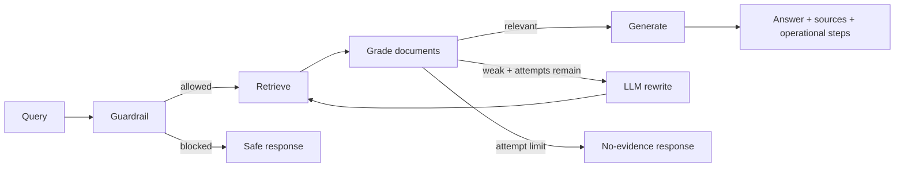

# Production Agentic RAG Platform

Production-oriented Agentic RAG reference implementation using FastAPI, a compiled LangGraph workflow, OpenSearch BM25/hybrid retrieval, Ollama-compatible generation, explicit source lineage, bounded corrective retrieval, evaluation hooks and security guardrails.

## Runtime flow



The graph is compiled with LangGraph and executed asynchronously. Request-scoped `top_k`, search mode, model and category filters flow into retrieval/generation.

## Retrieval

`use_hybrid=false` runs BM25. `use_hybrid=true` constructs a real OpenSearch hybrid query containing lexical and neural clauses. Hybrid mode requires a deployed OpenSearch neural model via `OPENSEARCH_NEURAL_MODEL_ID`; a normalization/RRF search pipeline can be supplied with `OPENSEARCH_SEARCH_PIPELINE`.

## Source integrity and safety

Sources are produced from structured `document_id + chunk_id` metadata, not reconstructed from generated prose. Retrieved passages are explicitly treated as untrusted evidence. Retrieval attempts are bounded and basic prompt-injection patterns are blocked before retrieval.

## Stack

Python 3.12, FastAPI, Pydantic, LangGraph, OpenSearch, Redis cache adapter, Ollama-compatible LLM provider, pytest, Ruff and mypy.

> Redis caching infrastructure is implemented as an adapter but is not yet inserted into every graph node. Langfuse settings remain an extension point; do not interpret them as active tracing.

## Quick start

```bash
cp .env.example .env
docker compose up -d
# Pull the configured model into Ollama, e.g.:
docker compose exec ollama ollama pull llama3.2:3b

python -m venv .venv
# Windows: .venv\Scripts\activate
# macOS/Linux: source .venv/bin/activate
pip install -e ".[dev]"
uvicorn app.main:app --reload
```

For hybrid retrieval, configure an OpenSearch neural model/index/search pipeline and set the corresponding environment variables. BM25 mode works without the neural model by sending `"use_hybrid": false`.

## Ingestion

Documents can now be chunked, embedded and indexed through `POST /api/v1/ingest`.

```json
{
  "documents": [
    {
      "document_id": "REQ-101",
      "title": "RAG Requirements",
      "text": "Long document content...",
      "category": "requirements",
      "authors": ["QE Team"]
    }
  ]
}
```

The pipeline normalizes text, creates deterministic chunk IDs, generates Ollama embeddings, bootstraps a KNN-capable OpenSearch index, and bulk-indexes structured lineage plus vectors. Re-ingesting an unchanged chunk uses the same OpenSearch document ID.

Pull the configured embedding model before ingestion:

```bash
docker compose exec ollama ollama pull nomic-embed-text
```

## Knowledge file upload

Phase 3A adds `PDF`, `DOCX`, `TXT` and `Markdown` uploads.

```text
POST /api/v1/documents/upload
GET  /api/v1/documents
GET  /api/v1/documents/{document_id}
```

Uploads are validated by extension and size, hashed with SHA-256 for duplicate detection, parsed locally, then passed through the existing chunk → embed → OpenSearch pipeline. Document lifecycle is exposed as `queued`, `parsing`, `ingesting`, `indexed`, or `failed`.

FastAPI background tasks are used for this reference implementation. The registry is intentionally in-process and therefore non-durable; production deployments should replace it with PostgreSQL/another durable store and a persistent job queue.

## Durable ingestion (Phase 3B)

A PostgreSQL-backed document registry and job queue are now available under `/api/v1/durable`. The standalone worker claims queued jobs transactionally, processes retained source bytes, and records retry state.

Key operations:

```text
POST   /api/v1/durable/documents/upload
GET    /api/v1/durable/documents
GET    /api/v1/durable/documents/{id}
GET    /api/v1/durable/documents/{id}/versions
POST   /api/v1/durable/documents/{id}/retry
POST   /api/v1/durable/documents/{id}/reindex
DELETE /api/v1/durable/documents/{id}
GET    /api/v1/durable/jobs/{job_id}
```

Docker Compose includes PostgreSQL and a dedicated ingestion worker. Job claiming uses database row locking with skip-locked semantics, allowing multiple workers to consume the queue safely. Failed jobs are re-queued until the configured attempt limit. Re-index removes prior OpenSearch chunks for the document before indexing again.

The original Phase 3A in-process endpoints remain for reference/backward compatibility; production-oriented deployments should use the durable endpoints.

## Redis cache + Langfuse observability

The Agentic RAG runtime now supports fail-open Redis caching for retrieval and LLM responses. Cache keys include request/model/retrieval parameters and use SHA-256. Successful KB ingestion invalidates retrieval and LLM namespaces so stale knowledge is not intentionally retained.

When `LANGFUSE_ENABLED=true`, requests create an Agentic RAG trace and nested retriever/generation observations. The feedback API records a numeric `user-feedback` score against the returned trace ID. Configure `LANGFUSE_HOST`, `LANGFUSE_PUBLIC_KEY`, and `LANGFUSE_SECRET_KEY`.

Caching is controlled by `CACHE_ENABLED` and `CACHE_TTL_SECONDS`. Redis failures are fail-open: the underlying retriever/model remains available.

## AI Quality Evaluation Engine

Phase 6 adds a versioned evaluation contract and regression gate at `POST /api/v1/evaluations/run`. A dataset contains named/versioned test cases with queries, expected relevant document IDs, expected answer terms and normal RAG runtime parameters.

The engine executes the real Agentic RAG service and reports per-case plus aggregate **Recall@K, Precision@K, MRR, nDCG, answer-term relevance, citation correctness, safety, retrieval attempts and latency**. Every result includes the Langfuse-compatible RAG `trace_id` for failure investigation.

Thresholds are configurable per run. `regression_gate_passed` is true only when every case satisfies all configured quality thresholds. The deterministic metrics are intentionally inspectable; semantic LLM-as-judge evaluation is a future extension rather than being presented as implemented.

## Evaluation history and quality trends

Phase 7 persists evaluation runs and individual case results in the platform database. This preserves Langfuse trace IDs alongside quality metrics for failure drill-down and provides APIs suitable for a quality dashboard:

```text
GET /api/v1/evaluations/history
GET /api/v1/evaluations/{run_id}
GET /api/v1/evaluations/compare/{baseline_id}/{current_id}
```

History exposes quality and latency trends. Run detail returns every case result and trace ID. Comparison calculates baseline-to-current deltas for pass rate, retrieval quality, ranking quality, answer relevance, citation correctness, safety and latency, and explicitly flags a pass-rate quality decrease.

## Advanced semantic evaluation

Phase 9 adds an optional LLM-as-a-Judge layer on top of the deterministic evaluation engine. Set `judge_enabled=true` and provide `judge_model` in an evaluation request to score faithfulness, groundedness, completeness, context relevance, hallucination risk and robustness.

Judge output is constrained to bounded JSON scores. Valid scores can participate in the regression gate through `min_judge_quality` and `max_hallucination`. Judge parsing/provider failures are fail-open and represented through judge coverage rather than terminating the deterministic evaluation run. This keeps deterministic retrieval, citation and safety metrics independently auditable.

## Visual AI Quality Dashboard

Phase 8 adds a native dashboard at `/dashboard`. It uses the persisted evaluation history and provides:

- release-gate status and latest quality KPIs;
- pass-rate, retrieval and citation trend visualization;
- evaluation history across dataset versions;
- clickable run drill-down;
- failed-case details with trace IDs for observability investigation.

The dashboard is deliberately served by the existing FastAPI application so the reference deployment does not require a separate frontend service. Chart.js is loaded from a public CDN; production environments with restricted egress should self-host the static asset.

## API

```json
POST /api/v1/ask
{
  "query": "What are practical approaches to RAG evaluation?",
  "top_k": 5,
  "use_hybrid": false,
  "model": "llama3.2:3b",
  "categories": ["cs.AI", "cs.IR"]
}
```

## Validation

```bash
ruff check .
mypy app
pytest -q --cov=app --cov-report=term-missing
```

See `docs/ARCHITECTURE.md`, `docs/EVALUATION.md`, `docs/PRODUCTION_READINESS.md` and `SECURITY.md`.

## Status

Implemented: FastAPI contracts, compiled LangGraph orchestration, BM25/hybrid OpenSearch adapter, Ollama generation, LLM query rewrite, document grading, structured citations, bounded retries, versioned AI Quality evaluation/regression gates, Redis caching, Langfuse observability, Docker services and automated tests.

Still required for enterprise production: external object storage for large source files, schema migrations, identity/RBAC, tenant-aware authorization, durable local feedback records, cache hit/miss metrics endpoint, secret-manager integration, stronger worker leases/dead-letter handling, security scanning and deployment-specific SLOs.

## License

MIT.
