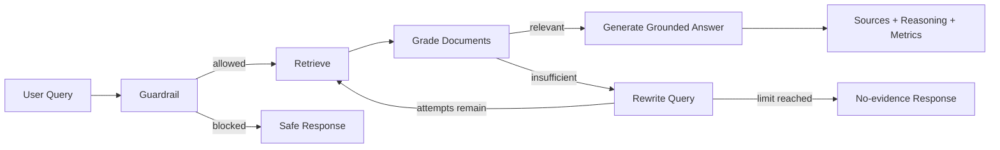

# Production Agentic RAG Platform

A production-oriented, testable Agentic RAG reference implementation built with FastAPI, LangGraph, hybrid retrieval, explicit source lineage, bounded corrective retrieval, evaluation hooks, observability, caching, and security guardrails.

> This is an independent implementation inspired by common production RAG patterns. It is not a verbatim copy of another repository.

## Why this repository exists

Traditional RAG is often a single retrieve-then-generate chain. This project models retrieval as an explicit workflow:



## Production improvements

- Request-scoped `top_k`, hybrid/BM25 mode, model and category filters are propagated into runtime context.
- Sources are extracted from structured retrieval artefacts; citation lineage is not reconstructed from free text.
- Retrieval loops have hard attempt limits.
- Guardrail failures fail closed by default.
- Retrieved text is treated as untrusted data and wrapped with anti-injection instructions.
- Stable chunk/document IDs support auditability.
- Evaluation metrics cover retrieval, grounding, citation correctness and operational efficiency.
- Unit/API tests cover the real configuration contracts rather than only mocked response shapes.
- Docker Compose includes health checks and production warnings.
- GitHub Actions runs lint, type checks and tests.

## Stack

Python 3.12, FastAPI, Pydantic, LangGraph/LangChain, OpenSearch, Redis, Ollama-compatible LLMs, sentence-transformers, Langfuse-compatible tracing, pytest.

## Quick start

```bash
cp .env.example .env
docker compose up -d
python -m venv .venv
# Windows: .venv\Scripts\activate
# macOS/Linux: source .venv/bin/activate
pip install -e ".[dev]"
uvicorn app.main:app --reload
```

Open `/docs` for Swagger. Health endpoint: `GET /api/v1/health`.

## Ask API

```json
POST /api/v1/ask
{
  "query": "What are practical approaches to RAG evaluation?",
  "top_k": 5,
  "use_hybrid": true,
  "model": "llama3.2:3b",
  "categories": ["cs.AI", "cs.IR"]
}
```

The response includes answer, structured sources, reasoning steps, retrieval attempts, search mode and trace ID.

## Architecture

See [docs/ARCHITECTURE.md](docs/ARCHITECTURE.md), [docs/PRODUCTION_READINESS.md](docs/PRODUCTION_READINESS.md), and [docs/EVALUATION.md](docs/EVALUATION.md).

## Validation

```bash
ruff check .
mypy app
pytest -q --cov=app --cov-report=term-missing
```

## License

MIT. See [LICENSE](LICENSE).
